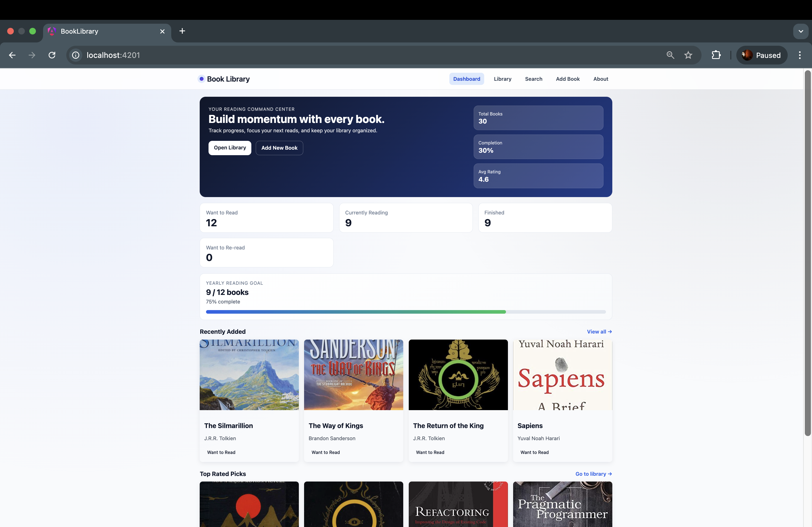
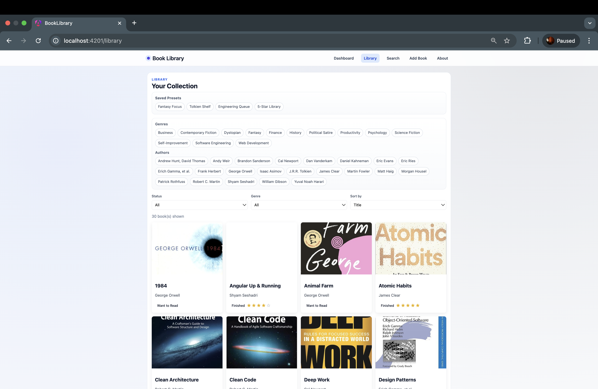
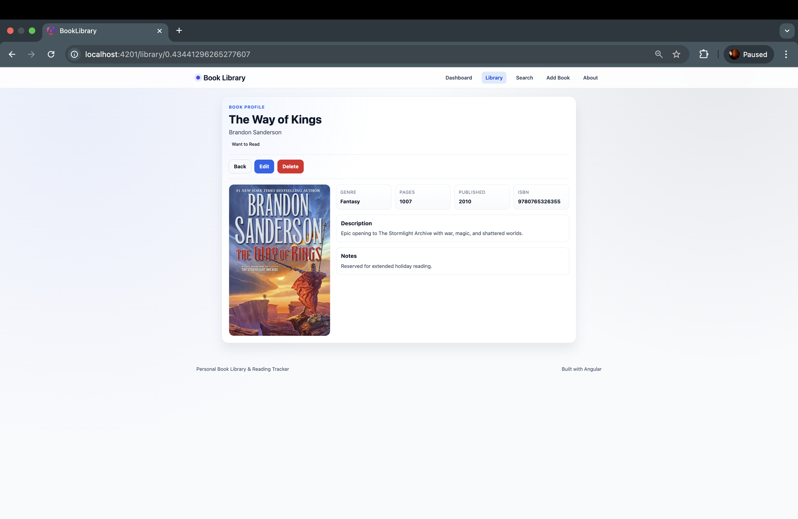
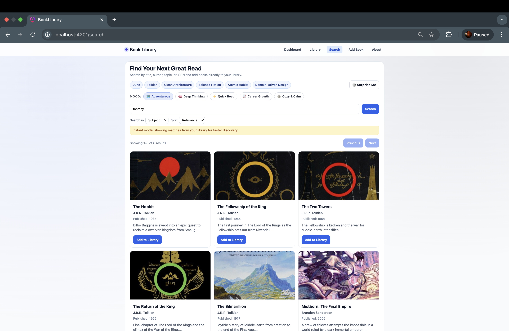
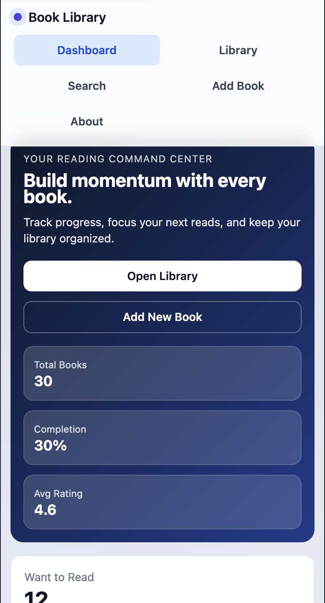
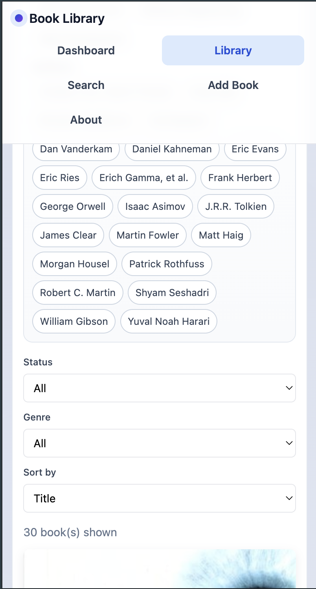
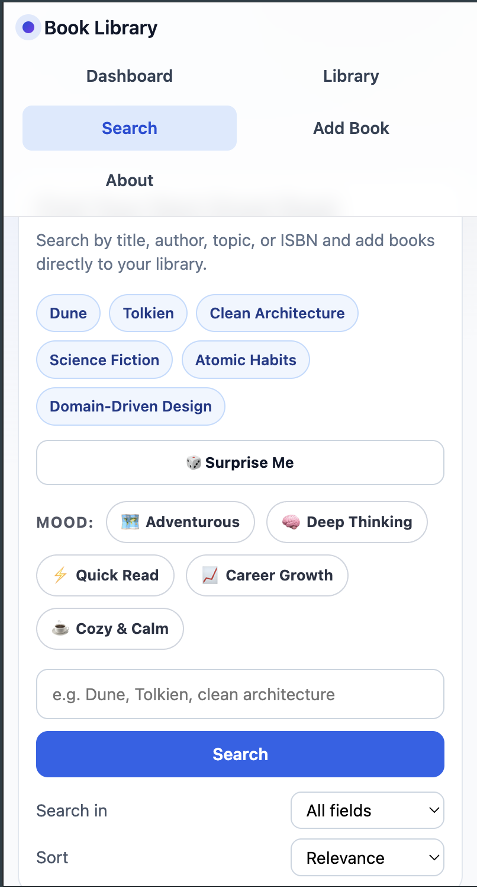

# Personal Book Library & Reading Tracker

A modern Angular single-page application for managing a personal book collection, tracking reading progress, discovering books from Google Books, and monitoring reading statistics through a dashboard.

## Final Submission Links
GitHub Repository: (https://github.com/uratabazi/Book-library)
Live Demo (Netlify): (https://your-site-name.netlify.app](https://my-book-library-project.netlify.app)

## Setup Instructions

### Prerequisites
- Node.js 18+ (or newer)
- npm

### Install
```bash
npm install
```

### Run (Development)
```bash
npm run start
```

Open the app in your browser using the URL shown by Angular dev server (commonly `http://localhost:4200` or next available port).

### Build (Production)
```bash
npm run build -- --watch=false
```

### Run Tests
```bash
npm run test
```

## Technology Stack

- Angular 21 (standalone components, router, forms)
- TypeScript
- RxJS
- Angular Material (dialog + snackbar)
- SCSS

## Features Implemented

### Core Features
- Book library grid with title, author, cover image, and status badge
- Book filtering by status and genre (plus author quick filters)
- Book sorting by title, date added, and rating
- Empty, loading, and error states in key views
- Book details page with high-end layout and full metadata
- Add Book and Edit Book flows with form validation and feedback
- Delete with confirmation dialog and return to library
- Reading statuses: `want-to-read`, `currently-reading`, `finished`, `want-to-reread`
- Google Books search integration with result cards and add-to-library
- Search fallback/error handling and local-first result behavior
- Dashboard with totals, status counts, completion rate, average rating, and reading goal progress

### Bonus/Polish Features
- Premium responsive UI for desktop and mobile (including iPhone SE pass)
- Route-level lazy loading for feature pages
- Saved filter presets and quick chips in library/search
- Instant details navigation with state/snapshot preload for faster UX
- Duplicate-book handling with practical re-read status conversion

## Routing Overview

- `/` → Dashboard
- `/home` → Redirect to Dashboard
- `/library` → Book list
- `/books` → Redirect to `/library`
- `/library/:id` → Book details
- `/books/:id` → Redirect to `/library/:id`
- `/search` → Search/discovery
- `/add` → Add book
- `/books/add` → Redirect to `/add`
- `/add/:id` → Edit book
- `/books/edit/:id` → Redirect to `/add/:id`
- `/about` → About page
- `**` → Redirect to `/`

## API Keys / Configuration

This project currently calls Google Books public endpoint directly:
- `https://www.googleapis.com/books/v1/volumes`

No API key is required for the current setup.

## Screenshots of Main Features

Screenshots are committed in the repository root and render in Markdown preview/GitHub.

### Desktop Screenshots

<p>
	
	
</p>
<p>
	
	
</p>

### Phone Screenshots (Mobile View)

<p>
	
	
	
	
</p>

## Rubric Mapping (Technical Implementation 40%)

- **Proper use of routing:** Implemented multi-page SPA navigation with redirects, parameterized routes, and wildcard fallback (`/`, `/library`, `/library/:id`, `/search`, `/add`, `/add/:id`, `/about`).
- **Component architecture:** Organized into focused standalone feature components (dashboard, list, details, form, search) plus shared UI components and app shell (header/footer).
- **Service/data layer:** Uses dedicated services for book state management (`BookService`), search API integration (`SearchService`), and dashboard metrics (`StatsService`).
- **Form handling and validation:** Add/Edit forms use Angular Reactive Forms with required fields, pattern/range checks, and custom validators for higher-quality input.
- **Async operations and cleanup:** Uses RxJS observables with operators such as `take(1)`, `timeout`, `finalize`, and `catchError` to control requests and handle failures safely.
- **TypeScript usage:** Strong typing is applied across models, service contracts, component state, and union types (for example, `Book`, `BookStatus`, and typed API responses).
- **Code organization:** Clear separation under `src/app` by concerns (`components`, `shared`, `services`, `models`) with maintainable feature-focused structure.

## Known Issues / Limitations

- One non-blocking production warning remains: `search.component.scss` exceeds the Angular component-style warning budget (`4kB`) by a small margin.
- Data is maintained in-memory in the service during runtime; it resets when the app restarts.

## Reflection

The most challenging parts were balancing strict data validation, smooth UX, and responsive layout polish across all pages. Making Edit/Delete reliably functional required handling route-param ID types (`string`) against in-memory IDs (`number | string`) in a consistent way. I learned how much perceived performance improves by using navigation state and snapshot-first rendering before async fallback, and how to keep Angular standalone architecture clean while still delivering a professional multi-page experience.
